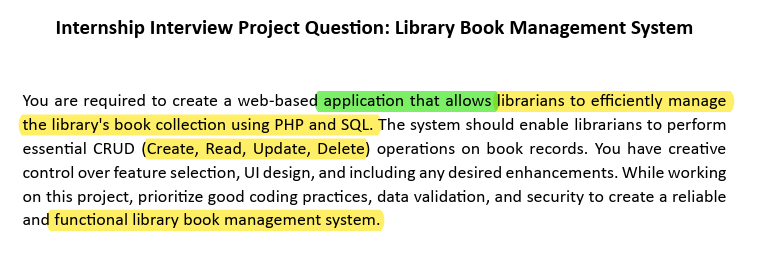
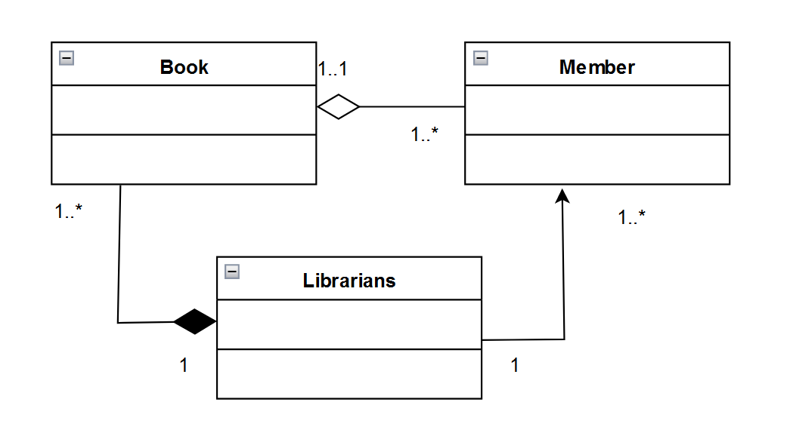

<p align="center">
  
</p>

Setup XAMPP Controll Pannel

Setup VS Code editor

Setup Composer for testing

## Considering SDLC

1. Define Requirements

<p align="center">
  
</p>

2. Design

A Class Diagram provides a high-level overview of the structure of the system

<p align="center">
  
</p>

3. Development

//Coding

4.Testing

### 1 step : Composer install

```bash
composer init
composer install
```

### 1 step : Update composer using

```bash
composer dump-autoload
```

### 2 step : Run Test

```bash
vendor\bin\phpunit tests\BookTest.php
```

## Special Note:

\*\* Composer have to stetup (No vendor file)

\*\* Username = admin

\*\* password = admin

\*\* DB queries in libray.sql file
